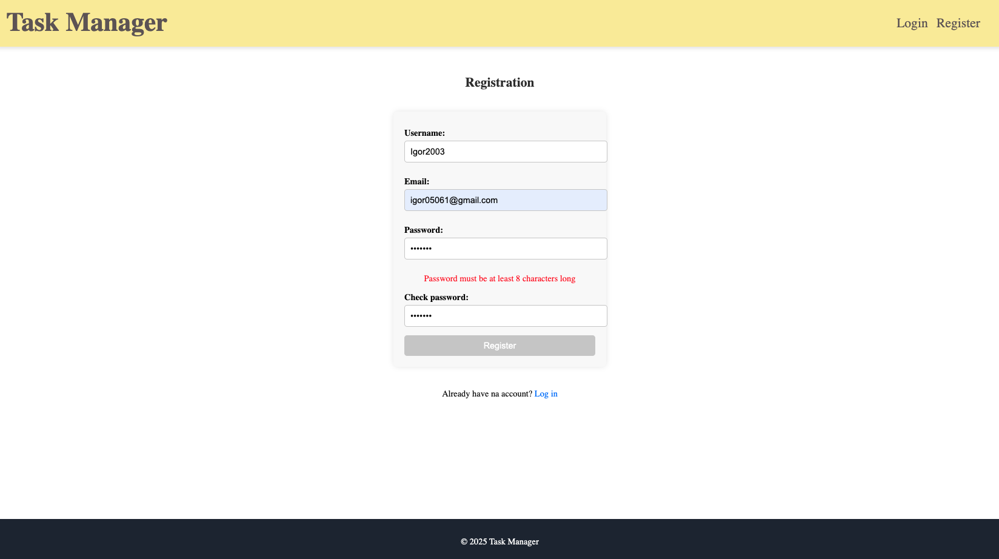
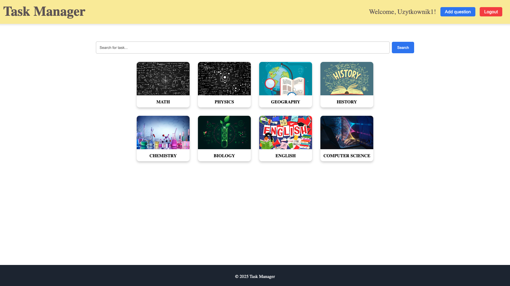
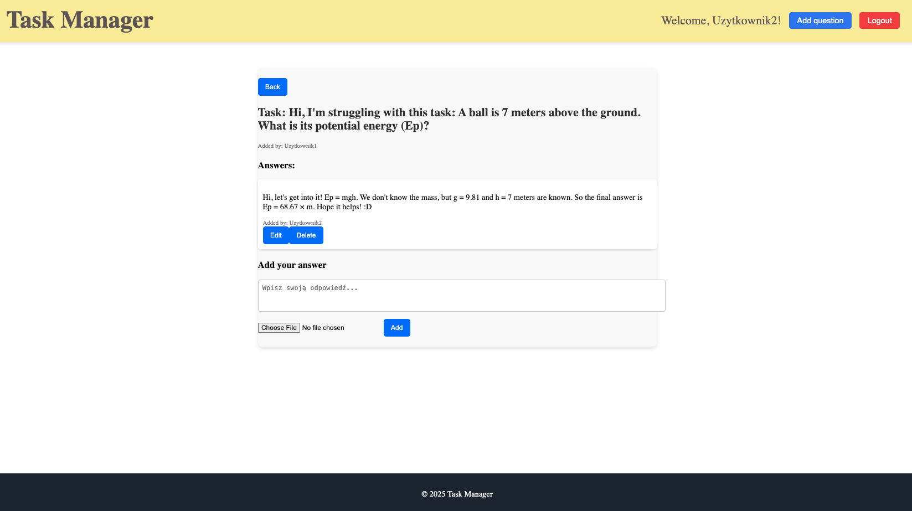
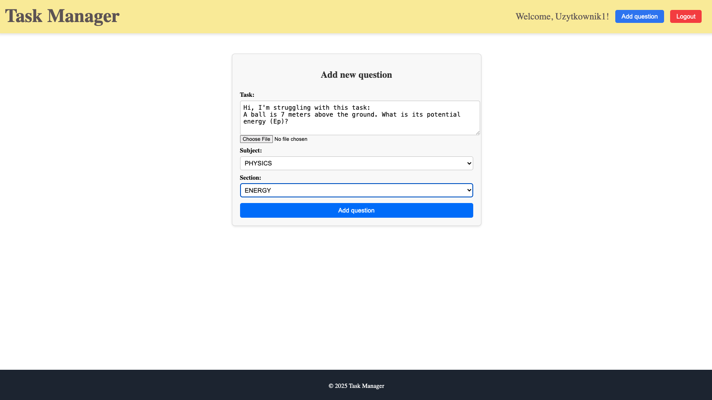

# Task Manager

Task Manager is a web application, that let users post questions and answers.
Technologies used:
- Backend **SpringBoot** (Java + Maven)
- Frontend **Angular**
- Database **PostgreSQL**
- Launch app in **Docker**

# Features 
User can:
- create and account
- login to created account
- post questions on forum for specific subject and section
- post answers for specific questions
- add image to question/answer
- edit his own question/answer
- delete his own question/answer

# Screenshots

